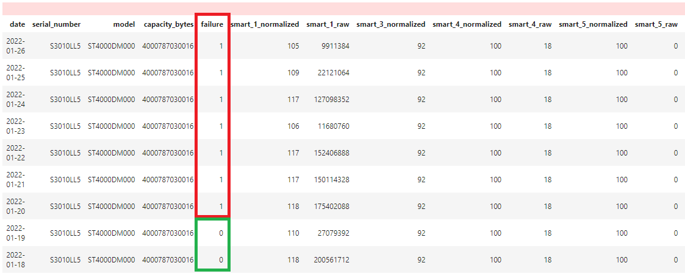
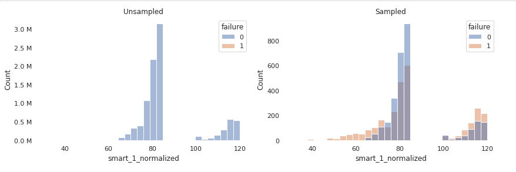

# Evaluation of Gradient Boosted Models for Hard Drive Failure Prediction in Data Centers

## Background  
In recent years, the expansion of the internet of things (IoT) and industrial internet of things (IIoT) connectivity and sensors have contributed to advancements in predictive maintenance (Market Research Future, 2022). In fact, by 2030 the predictive maintenance market is forecasted to reach $111.34 billion USD (Market Research Future, 2022). Historically, maintenance primarily consisted of corrective and preventative (Maintenance (technical), 2022). Of the two maintenance types, corrective maintenance is often more expensive due to consequential part damage or downtime (Maintenance (technical), 2022). Preventative maintenance can also be costly due to the unwarranted replacement of parts (Maintenance (technical), 2022). In contrast, predictive maintenance utilizes sensors to monitor equipment health conditions, which is combined with analytics to predict and prevent unexpected equipment failures (Predictive maintenance, 2022). Predictive maintenance offers benefits such as cost savings, improved reliability, and reduced downtime (Predictive maintenance, 2022).  

One industry that can and is benefitting from predictive maintenance are data centers. Depending on the type of the data center, various levels of fault tolerances and redundancy exist, which equate to a range of uptime requirements from 99.671% (28.8 hours annual downtime) to 99.995% (26.3 minutes annual downtime) (Hewlett Packard Enterprise Development LP, 2022). To maintain the high level of uptime and availability, predictive maintenance is being leveraged to forecast failure on equipment including, but not limited to, generators, power distribution units (PDU), transfer switches, transformers, and uninterruptible power supplies (UPS) (Tyrrell, 2022). Not only is data center ancillary equipment benefitting from predictive maintenance, but data center computing equipment such as hard drives might also benefit.  

## Problem statement  
Accurately predicting hard drive failures within a data center can ensure operational readiness, improve reliability, and reduce costs. Although there are protective measures in place to distribute files or objects over different hard drives and locations, hard drive failures still present a risk of data loss to customers (Wilson, 2018).  

The project aimed to determine if gradient boosted models can predict classification of a hard drive failure in a data center environment. Furthermore, the project compared gradient boosted classifier models including LightGBM, CatBoost, and XGBoost to discern which model provided the best evaluation metrics, specifically F-scores (F1 and F2).  

## Computing environment  
For the computing environment, a component on the Saturn Cloud hosted environment was used. Saturn Cloud allows for scalable Jupyter Servers to be run on AWS EC2 instances. Initially, the project started on a XLarge instance which equates to an AWS EC2 r5.xlarge instance. However, as computing resource demands grew, the project advanced to a 4XLarge instance which equates to an AWS r5.4xlarge instance.  

The project was based on Python and consisted of various Python libraries. For data collection, the Python standard library and the Requests library was used. Throughout the project, the PyArrow library was used for reading and writing data to Parquet files. For data transformation and initial exploratory data analysis (EDA), the PySpark library was used. Further EDA efforts involved Pandas, Matplotlib, and Seaborn libraries. Feature selection leveraged Feature-engine and Scikit-learn libraries. Lastly, machine learning tasks utilized Imbalanced-learn, Scikit-learn, Scikit-optimize, LightGBM, CatBoost, and XGBoost libraries.  

Link to Saturn Cloud: [https://saturncloud.io/](https://saturncloud.io/)  
Link to YAML environment:  [environment.yml](notebooks/environment.yml)  

## Data collection and source  
Available hard drive data, especially in a data center environment is extremely limited and difficult to obtain. Fortunately, in 2015, Backblaze, a cloud storage company, started producing quarterly data on the 41,000 HDD within the Backblaze data centers (Beach, 2015).The quarterly reports consist of daily hard drive snapshots in comma separated value (CSV) format compressed into a ZIP file (Beach, 2015). Each hard drive snapshot includes fields for date, serial number, model, capacity, failure, and S.M.A.R.T. attributes (Beach, 2015).  

S.M.A.R.T. attributes or Self-Monitoring, Analysis and Reporting Technology monitors the health of hard drives and is intended to “detect and report various indicators of drive reliability with the intent of anticipating imminent hardware failures” (S.M.A.R.T., 2022). For each S.M.A.R.T. attribute there is a raw and a normalized value. S.M.A.R.T. attributes are vendor specific and may or may not share commonality between vendors  (S.M.A.R.T., 2022). The raw values are determined by the manufacturer but can equate to counts, whereas normalized values range from 1 to 253, where 1 is the worst value, 100 is the default value, and 253 is  the best value (S.M.A.R.T., 2022). The target or variable attempting to be predicted is the failure field. The failure field entails a 0 for functional and 1 for non-functional, making the project a machine learning binary classification problem. The significant disproportion of functional hard drive snapshots to non-functional hard drive snapshots reveals that there is an extreme class imbalance.  

The first quarter of 2022 report in ZIP file format was downloaded via HTTP URL from the Backblaze website, the CSVs files were extracted, and a Parquet file was created for the quarter.  

Link to Backblaze data: [https://www.backblaze.com/b2/hard-drive-test-data.html](https://www.backblaze.com/b2/hard-drive-test-data.html)  

## Data preparation (extract, transform, load)  
The Parquet file was approximately 1.5 GB. The large amount of data presented challenges throughout the project. One challenge was reading the large dataset into Python. PySpark library proved to be the best option to reasonably handle the data. Although PySpark is intended for distributed computing, PySpark can be run locally for development and testing. To achieve optimal performance for running locally, experiments were carried out with various PySpark configurations.  

To begin analysis, a dataframe consisting of 18.8 million rows and 179 columns was created from the Parquet file. The 18.8 million rows represented the hard drive snapshots (daily) and the 179 columns represented the features (date, serial number, model, capacity bytes, failure (target), and the S.M.A.R.T. attributes). Data exploration revealed that there were 212,404 hard drives. One hard drive could have as many as 90 snapshots for each day in the first quarter of 2022.  

The data contained hard drive models with and without manufacturer. Once the manufacturer was researched and added to each model, an assessment was made to select one manufacturer. Although one manufacturer had a higher percentage of failure, the sample size for non-functional was very low (11). Seagate was selected due to the greatest number of samples.  

Another issue encountered was that the Seagate models included both hard disk drives (HDD) and solid state drives (SSD) models. After research, Seagate (n.d.) stated that not all BIOS by manufacturers interpret SSD S.M.A.R.T. attributes correctly. Moreover, there are HDD and SSD S.M.A.R.T. attributes that overlap (S.M.A.R.T., 2022). To avoid conflicting measurements between the models, a decision was made to remove the SSD. Next, hard drive models with no failures were removed. The end result of reducing by manufacturer, model, and no failures, equated to 14 Seagate HDD models.  

Subsequently, a deeper dive into NaN or null (missing values) was pursued. Columns and rows with 40% or missing values were removed. There were 5 columns identified with having a single value. Since a single value does not contribute to predictive value, those columns were removed. Narrowing the focus to one manufacturer, HDD models, models with failures, and removing missing values assisted with the data dimensionality reduction, resulting in 9.2 million rows (originally 18.8 million) and 40 columns (originally 179). More than 50% of the rows were reduced and the columns were reduced by nearly a factor of 5. The class imbalance for majority to minority equated to a ratio of 3,253 to 1 or 0.03% for the minority class.  

Predicting failure at the point of failure offers little contribution toward predictive maintenance, since the focus is to prevent unexpected equipment failures (Predictive maintenance, 2022). 
Knowing a failure is going to happen at the time of failure does not provide adequate notification to take action to prevent the failure. The failure (target) field presents challenges due to a failure being reported in the hard drive snapshot on the day of failure. To overcome this obstacle, a literature review was conducted to examine possible solutions and a strategy was devised to create a deteriorating window. The deteriorating window classified the 6 days of snapshots leading to the failure as ‘non-functional’ (or 1). The intent was to predict the hard drive failure within those 7 days to provide ample time to replace the hard drive before failure.  

  

## Exploratory data analysis  
A moderate amount of data exploration was performed during the data preparation phase. In continuation with exploratory data analysis (EDA), descriptive statistics were assessed on both categorical and numerical features. For categorical features, counts, unique values (for high cardinality), top values, and frequencies were calculated. For numerical features, counts, average (mean), minimum, quartiles, and maximum values calculated. Each feature was examined through aggregation. The presence of duplicates was also assessed. Features that presented potential issues of high cardinality were identified. One feature had 103,711 unique values and feature engineering such as binning was employed. Excessive zeros were also examined, and seven features indicated 50% or more zeros. Consideration was given to remove the features, but research indicated that most of the features were deemed critical to predicting hard failure. Features were also plotted. For categorical data, bar plots were used and for numerical data, histograms and violin plots were utilized. Resampling the data, provided a better distinction between classes. For bivariate analysis, pairwise plots and correlation plots were produced. The correlation plot revealed correlations between features. However, rather than removing these features, a decision was made to allow feature selection methods to determine the best features.  

  

## Feature selection
To establish an ensemble of the best features, 3 feature selection techniques were used - SelectKBest, random forest classifier feature importance, and SelectByShuffling. The SelectKBest feature method was used to determine the k features with the highest chi-squared stats between the feature and the class (Scikit-learn Developers, 2022). The random forest classifier feature importance method was used to obtain feature importance based on impurity decrease (Scikit-learn Developers, 2022). The SelectByShuffling method shuffles and selects features that do not result in a drop in model performance (Feature-engine developers, 2022). The results were combined and features that appeared 2 or more times across the methods were selected, as well as one S.M.A.R.T. attribute that was identified as potentially critical to predicting a failure; a total of 11 features (S.M.A.R.T., 2022).  
  
  
| ATTRIBUTE             | ATTRIBUTE NAME                                |
|-----------------------|-----------------------------------------------|
|     smart_5_raw       |     Reallocated Sectors Count                 |
|     smart_7_raw       |     Seek Error Rate                           |
|     smart_9_raw       |     Power-On Hours                            |
|     smart_187_raw     |     Reported Uncorrectable Errors             |
|     smart_188_raw*    |     Command Timeout                           |
|     smart_193_raw     |     Load Cycle Count                          |
|     smart_197_raw     |     Current Pending Sector Count              |
|     smart_198_raw     |     (Offline) Uncorrectable Sector Count      |
|     smart_240_raw     |     Head Flying Hours                         |
|     smart_241_raw     |     Total LBAs Written                        |
|     smart_242_raw     |     Total LBAs Read                           |
  
(S.M.A.R.T., 2022)  

## Machine learning  
As previously observed, there was a substantial class imbalance between non-functional (0) and functional (1). To mitigate the issues of class imbalance, random over-sampling was used to boost the samples of the minority class and random under-sampling was used to reduce the majority class. Using the 11 features from the feature selection effort, a random forest classifier with default parameters was created to establish a baseline. The metric for evaluation was primarily the F1 score and if the results were close, preference would go to the model with a higher F2 score (giving preference to recall). The random forest classifier had a moderate F-score. Subsequently, three gradient boosted classifier methods were evaluated - LightGBM, CatBoost, and XGBoost. Each model utilized BayesSearchCV with StratifiedKFold to find the optimal parameters. Hyperparameter tuning was performed on the resampled data with the new features. Also, the parameter grid was very limited due to complexity and computational constraints. Each model was run on the entire data with default parameters and run again with the best parameters from the BayesSearchCV. The ‘scale_pos_weight’ parameter was used to offset the extreme class imbalance. Surprisingly, LightGBM performed poorly with default and tuned parameters. XGBoost with tuned parameters had the highest F1 score and CatBoost with tuned parameters had the highest F2 score.  
  
  
|     MODEL                                                    |     ACCURACY    |       F1     |       F2     |
|--------------------------------------------------------------|:---------------:|:------------:|:------------:|
|     Random forest classifier (default; selected features)    |       100%      |     0.727    |     0.635    |
|     LightGBM classifier (default; selected features)         |       100%      |     0.240    |     0.236    |
|     LightGBM classifier (tuned; selected features)           |       94.4%     |     0.001    |     0.003    |
|     CatBoost classifier (default; selected features)         |       100%      |     0.731    |     0.650    |
|     CatBoost classifier (tuned; selected features)           |       100%      |     0.760    |     0.836    |
|     XGBoost classifier (default; selected features)          |       100%      |     0.518    |     0.408    |
|     XGBoost classifier (tuned; selected features)            |       100%      |     0.810    |     0.806    |
  
  
## Summary  
The massive amount of data and class imbalance presented challenges throughout the project. PySpark performed well in exploring and reducing the data dimensionality and could perform better in a distributed environment. Random sampling (over and under) provided an adequate option for producing a smaller subset of data for hyperparameter tuning. GridSearchCV proved to be computationally complex for the data, RandomSearchCV did not seem to identify the optimal parameters, and instead BayesSearchCV seemed to provide the best parameters. Performing complex hyperparameter searches also presented challenges, as expanding a hyperparameter search could take hours. Surprisingly, the LightGBM model performed poorly and tuning only . The CatBoost and XGBoost models with tuned features demonstrated improvements over the random forest model.  

## Next Steps  
Early in the project, experiments were made using a deteriorating window of 3 days, as well as focusing on a single hard drive model, but neither showed significant improvements. However, the project evolved, improved, and might benefit from a reexamination of these areas. For instance, there might be an optimal window within the range of less than 7 days or greater than 7 days. Or hard drive models starting with ST1200NMxxxx might share more common attributes and characteristics. There might be a more suitable sampling method other than random sampling. Initially, SMOTE (synthetic minority over-sampling technique) was evaluated, but a decision was made not to use synthetic data. SMOTE might produce better sample variations. Except for the LightGBM model, improvements were observed with hyperparameter tuning. Perhaps, a more expansive search of hyperparameters that could be allowed to run for hours or days, or using libraries such as Hyperopt or Optuna, could identify more optimal hyperparameters. Lastly, there might be opportunity for further improvement by testing machine learning libraries suited for larger data, such as Spark MLlib or TensorFlow Keras Decision Trees (Yggdrasil) (Abuzaid et al., 2016).  

## YouTube Video  
Link to YouTube video: [Evaluation of Gradient Boosted Models for Hard Drive Failure Prediction in Data Centers](https://www.youtube.com/watch?v=sDEzNSEYqok)  

## References  
Abuzaid, F., Bradley, J.,Liang, F., Feng, A., Yang, L., Zaharia, M., & Talwalkar, A. (2016). Yggdrasil: An optimized system for training deep decision trees at scale. <i>29th Conference on Neural Information Processing Systems.</i> https://www.cs.cmu.edu/~atalwalk/yggdrasil_nips_with_appendix.pdf  
 
Backblaze. (2022). <i>Hard drive data and stats.</i> https://www.backblaze.com/b2/hard-drive-test-data.html  
 
Beach, B. (2015, February 4). <i>Reliability data set for 41,000 hard drives now open-source.</i> Backblaze Blog. https://www.backblaze.com/blog/hard-drive-data-feb2015/  
 
F-score. (2022, September 18). In <i>Wikipedia</i>. https://en.wikipedia.org/w/index.php?title=F-score&oldid=1110996374  
 
Feature-engine developers. (2022). <i>SelectByShuffling</i>. Feature-engine API. https://feature-engine.readthedocs.io/en/latest/api_doc/selection/SelectByShuffling.html  
 
Hewlett Packard Enterprise Development LP. (2022). <i>What are data center tiers?</i> https://www.hpe.com/uk/en/what-is/data-center-tiers.html  
 
Maintenance (technical). (2022, September 18). In <i>Wikipedia</i>. https://en.wikipedia.org/w/index.php?title=Maintenance_(technical)&oldid=1110994458  
 
Market Research Future. (2022, June 16). <i>Predictive maintenance market to hit USD 111.34 billion by 2030, at a CAGR of 26.2% - report by Market Research Future (MRFR).</i> GlobeNewswire. https://www.globenewswire.com/en/news-release/2022/06/16/2463729/0/en/Predictive-Maintenance-Market-to-Hit-USD-111-34-Billion-by-2030-at-a-CAGR-of-26-2-Report-by-Market-Research-Future-MRFR.html  
 
Predictive maintenance. (2022, September 21). In <i>Wikipedia</i>. https://en.wikipedia.org/w/index.php?title=Predictive_maintenance&oldid=1111479330  
 
S.M.A.R.T. (2022, September 9). In <i>Wikipedia</i>. https://en.wikipedia.org/w/index.php?title=S.M.A.R.T.&oldid=1109378579  
 
Scikit-learn Developers. (2022). <i>Feature importances with a forest of trees.</i> https://scikit-learn.org/stable/auto_examples/ensemble/plot_forest_importances.html  
 
Scikit-learn Developers. (2022). <i>Sklearn.feature_selection.SelectKBest.</i> https://scikit-learn.org/stable/modules/generated/sklearn.feature_selection.SelectKBest.html  
 
Scikit-optimize contributors. (2020). <i>BayesSearchCV.</i> Scikit-optimize. https://scikit-optimize.github.io/stable/modules/generated/skopt.BayesSearchCV.html  
 
Spicer, T. (2017, June 14). <i>Apache Parquet: How to be a hero with the open-source columnar data format.</i> Openbridge. https://blog.openbridge.com/how-to-be-a-hero-with-powerful-parquet-google-and-amazon-f2ae0f35ee04  
 
Staubli, G. (2017, October 9). <i>Spark file format showdown – CSV vs JSON vs Parquet</i>. LinkedIn. https://www.linkedin.com/pulse/spark-file-format-showdown-csv-vs-json-parquet-garren-staubli/  
 
Tyrrell, J. (2022, July 28). <i>Efficiency gains: predictive maintenance supports data center operations.</i> TechHQ . https://techhq.com/2022/07/machine-learning-data-center-maintenance/  
 
Wilson, B. (2018, July 17). <i>Backblaze durability calculates at 99.999999999% — and why it doesn’t matter.</i> Backblaze. https://www.backblaze.com/blog/cloud-storage-durability/  
 
Yowakim, E. (2021, December 7). <i>Difference between Parquet and CSV.</i> LinkedIn. https://www.linkedin.com/pulse/difference-between-parquet-csv-emad-yowakim/  

